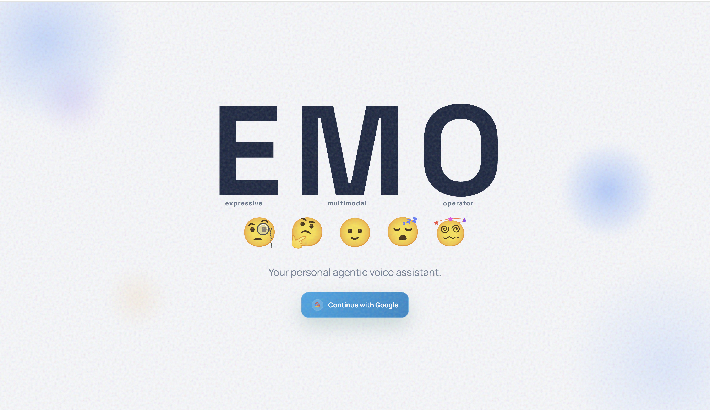

# Agentic Skill Backend Service




## 🎯 Project Vision

Create a modular, extensible backend service that handles skill execution for AI agents. Separate conversation management from task execution, allowing the voice assistant to focus on natural language understanding while this service handles API integrations, data processing, and external service interactions securely and efficiently. The system uses a skill-based architecture where capabilities are modular and can be installed/uninstalled by users.

## 🎯 What This Does

A backend service that executes skills for the voice assistant. It provides a unified API for scheduling calendar events, checking schedules, and searching meeting notes to help prepare for or discuss past meetings. Directly integrates with Google Calendar API and RAG (Retrieval Augmented Generation) for document queries.

## 🔗 How It Connects

The voice assistant calls this backend to execute skills:

```
Voice Agent → POST /internal/skills/{skill_name} → Backend Service → Google Calendar API → Return Results
```

**Connection Details:**
- **Backend URL**: `http://127.0.0.1:9000`
- **Authentication**: Internal API key via `X-Internal-API-Key` header
- **Voice Agent Repo**: `agentic-voice-assistant`
- **Shared Database**: Both services use the same Supabase PostgreSQL instance
- **Google Calendar Integration**: Direct API calls using user OAuth tokens from database

## 🛠️ Available Skills

### **Currently Working:**
- **google_calendar**: Creates Google Calendar events directly using user OAuth tokens
- **meeting_discussion**: Fetches calendar events and searches knowledge base using RAG for meeting notes to help prepare for or discuss past meetings

### **Knowledge Base (RAG):**
The `meeting_discussion` skill includes integrated RAG (Retrieval Augmented Generation) functionality:
- Supports querying uploaded documents (PDF, MD, TXT) using semantic search
- Automatically searches knowledge base when users ask about meeting notes, requirements, or document content
- Uses vector embeddings for intelligent document retrieval
- Returns relevant document chunks with source attribution

### **How Skills Work:**
1. Voice agent sends skill name and parameters to `POST /internal/skills/{skill_name}`
2. Backend fetches user profile (including OAuth refresh token) from shared database
3. Backend executes the skill using LangChain with direct Google Calendar API access
4. Results are returned to the voice agent

### **Extensibility:**
The service is designed for easy addition of new skills:
- **Skill Registration**: Simple decorator-based registration system
- **Centralized Configuration**: Skill-specific configs in `apps/skills/`
- **Generic Execution**: Single endpoint handles all registered skills
- **Type Safety**: Pydantic schemas for input validation
- **Error Handling**: Consistent error responses and logging

## 🏗️ Technology Stack

- **FastAPI**: Modern async web framework with automatic API documentation
- **Python 3.12**: Latest Python with async/await patterns for high performance
- **LangChain**: Tool management and orchestration framework
- **PostgreSQL**: Database hosted on Supabase for persistent storage
- **psycopg[binary]**: PostgreSQL database driver with async support
- **Google Calendar API**: Direct calendar integration using OAuth 2.0
- **Google OAuth 2.0**: Secure user authentication and token management
- **HTTPX**: Async HTTP client for internal service communication
- **Pydantic**: Data validation and settings management
- **Tenacity**: Retry logic for resilient API calls

## 🚀 How to Run

### **Quick Start**
Use the provided startup script to run all services together:
```bash
cd ../
./start-all.sh
```

### **Setup**
```bash
# Install dependencies
pip install -r requirements.txt

# Configure environment variables in .env file
```

### **Start Service**
```bash
# Option 1: Start all services at once using the startup script
cd ../
./start-all.sh

# Option 2: Start backend service individually (port 9000)
python -m uvicorn apps.api.main:app --reload
```

### **Environment Variables**
- `DATABASE_URL`: Supabase PostgreSQL connection string (shared with voice agent)
- `GOOGLE_OAUTH_CLIENT_ID`: Google OAuth client ID for Calendar API access
- `GOOGLE_OAUTH_CLIENT_SECRET`: Google OAuth client secret for Calendar API access
- `BACKEND_INTERNAL_API_KEY`: Internal API key for skill execution (must match voice agent's `BACKEND_INTERNAL_API_KEY`)
- `PROFILE_API_BASE_URL`: Voice agent URL for profile data (`http://127.0.0.1:8000`)
- `PROFILE_INTERNAL_API_KEY`: Voice agent internal API key (must match voice agent's `INTERNAL_API_KEY`)
- `GOOGLE_API_KEY`: Google API key for embeddings (required for RAG)
- `EMBEDDING_DIMENSION`: Embedding dimension for vector search (default: 3072)
- `DEFAULT_SKILLS`: Comma-separated list of default skills to auto-install (default: google_calendar)

### **Database Setup**
- **Provider**: Supabase (PostgreSQL hosting)
- **Shared Instance**: Both voice assistant and backend service use the same database
- **Purpose**: User profiles, OAuth refresh tokens, and application state
- **Setup**: Run `init_supabase.sql` in Supabase SQL Editor to initialize database schema (creates tables for user profiles, knowledge base vectors, and RAG functionality)
- **Important**: Database must include `google_refresh_token` column in `user_profiles` table for OAuth authentication

## 📡 API Endpoints

### **Skill Execution**
- `POST /internal/skills/{skill_name}` - Execute a specific skill
- `GET /internal/skills` - List all available skills
- `GET /health` - Health check

### **Profile Data**
- `GET /internal/profile/{sub}` - Internal endpoint for fetching user profiles (used by backend service to get OAuth tokens)

### **Internal Service Communication**
- **Profile API**: Backend service calls voice agent's `/internal/profile/{sub}` to get user data
- **Authentication**: Mutual authentication using shared internal API keys
- **Error Handling**: Retry logic with exponential backoff for resilient communication
- **Timeout**: Configurable timeout for external service calls

### **Authentication**
All endpoints require `X-Internal-API-Key` header for security.

## 🔐 OAuth Token Management

### **Authentication Flow:**
1. User authenticates via voice agent's Google OAuth flow
2. Voice agent stores OAuth refresh token in shared database (`user_profiles` table)
3. Backend service fetches user profile (including refresh token) when executing skills
4. Backend service uses refresh token to obtain access token for Google Calendar API
5. Google Calendar operations performed with user's own credentials

### **Security Notes:**
- OAuth tokens are stored securely in the database
- Refresh tokens are only accessible to authenticated backend services
- Internal API keys prevent unauthorized access to profile data
- Google OAuth scopes are limited to calendar access only

## 🏗️ System Architecture

### **Service Design:**
The backend service follows a clean architecture pattern:

```
┌─────────────────────────────────────────────────────────┐
│              FastAPI Application Layer                 │
│  ┌──────────────────────────────────────────────────┐  │
│  │  API Endpoints (/internal/skills/*, /health)     │  │
│  └──────────────────────────────────────────────────┘  │
└─────────────────────────────────────────────────────────┘
                            │
                            ▼
┌─────────────────────────────────────────────────────────┐
│              Skill Execution Layer                       │
│  ┌──────────────────────────────────────────────────┐  │
│  │  Skill Registry | LangChain Integration          │  │
│  │  google_calendar | meeting_discussion            │  │
│  └──────────────────────────────────────────────────┘  │
└─────────────────────────────────────────────────────────┘
                            │
                            ▼
┌─────────────────────────────────────────────────────────┐
│              External Integration Layer                  │
│  ┌──────────────────────────────────────────────────┐  │
│  │  Google Calendar API | Profile Client           │  │
│  │  OAuth Token Management | HTTPX Client           │  │
│  └──────────────────────────────────────────────────┘  │
└─────────────────────────────────────────────────────────┘
                            │
                            ▼
┌─────────────────────────────────────────────────────────┐
│              Data Layer                                  │
│  ┌──────────────────────────────────────────────────┐  │
│  │  PostgreSQL (Supabase) | User Profiles           │  │
│  │  OAuth Tokens | Application State               │  │
│  └──────────────────────────────────────────────────┘  │
└─────────────────────────────────────────────────────────┘
```

### **Request Flow:**
1. Voice agent sends skill execution request with parameters
2. API layer validates authentication and forwards to skill registry
3. Skill registry locates appropriate skill and validates input
4. Skill execution layer fetches user profile (including OAuth tokens)
5. External integration layer calls Google Calendar API with user credentials
6. Results flow back through layers to voice agent
7. All steps include error handling, logging, and retry logic
